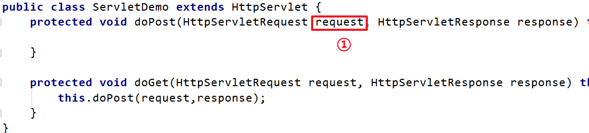

# 软件设计模式-详细讲解（代码示例）

## 1、项目介绍
&emsp;&emsp;软件设计模式（Software Design Pattern），又称设计模式，是一套被反复使用、多数人知晓
的、经过分类编目的、代码设计经验的总结。

&emsp;&emsp;本项目是通过代码示例的方式，讲解结构型模式：
- 代理模式
- 适配器模式
- 装饰者模式
- 桥接模式
- 外观模式
- 组合模式
- 享元模式

&emsp;&emsp;结构型模式描述如何将类或对象按某种布局组成更大的结构。它分为类结构型模式和对象结构型模式，前者采用继承机制来组织接口和类，后者釆用组合或聚合来组合对象。

&emsp;&emsp;由于组合关系或聚合关系比继承关系耦合度低，满足“合成复用原则”，所以对象结构型模式比类结构型模式具有更大的灵活性。

&emsp;&emsp;本项目属于《设计模式系列》：  
* [《通过代码示例，讲解单例模式：2种饿汉模式的实现、4种懒汉模式实现、序列化和反射是如何破坏单例的、如何防止序列化和反射破坏单例》](https://github.com/xiaoguangbiao-github/design_patterns_singleton.git)  
* [《通过代码示例，讲解创建型模式：工厂方法模式、抽象工厂模式、原型模式、建造者模式》](https://github.com/xiaoguangbiao-github/design_patterns_create.git)  
* [《通过代码示例，讲解结构型模式：代理模式、适配器模式、装饰者模式、桥接模式、外观模式、组合模式、享元模式》](https://github.com/xiaoguangbiao-github/design_patterns_structure.git)  
* [《通过代码示例，讲解行为型模式：模板方法模式、策略模式、命令模式、职责链模式、状态模式、观察者模式、中介者模式、迭代器模式、访问者模式、备忘录模式、解释器模式》](https://github.com/xiaoguangbiao-github/design_patterns_action.git)  


## 2、开发环境

- 语言：Java 8

- Eclipse/IDEA

- 依赖管理：Maven


## 3、项目目录
├├─adapter    &emsp;//适配器模式  
 │  ├─class_adapter  
 │  │&emsp;&emsp;   Client.java  
 │  │&emsp;&emsp;   Computer.java  
 │  │&emsp;&emsp;   SDAdapterTF.java  
 │  │&emsp;&emsp;   SDCard.java  
 │  │&emsp;&emsp;   SDCardImpl.java  
 │  │&emsp;&emsp;   TFCard.java  
 │  │&emsp;&emsp;   TFCardImpl.java  
 │  │&emsp;&emsp;   
 │  └─object_adapter  
 │&emsp;&emsp;       Client.java  
 │&emsp;&emsp;       Computer.java  
 │&emsp;&emsp;       SDAdapterTF.java  
 │&emsp;&emsp;       SDCard.java  
 │&emsp;&emsp;       SDCardImpl.java  
 │&emsp;&emsp;       TFCard.java  
 │&emsp;&emsp;       TFCardImpl.java  
 │&emsp;&emsp;       
 ├─bridge    &emsp;//桥接模式    
 │&emsp;&emsp;   AviFile.java  
 │&emsp;&emsp;   Client.java  
 │&emsp;&emsp;   Mac.java  
 │&emsp;&emsp;   OpratingSystem.java  
 │&emsp;&emsp;   RmvbFile.java  
 │&emsp;&emsp;   VideoFile.java  
 │&emsp;&emsp;   Windows.java  
 │&emsp;&emsp;   
 ├─combination    &emsp;//组合模式  
 │&emsp;&emsp;   Client.java  
 │&emsp;&emsp;   Menu.java  
 │&emsp;&emsp;   MenuComponent.java  
 │&emsp;&emsp;   MenuItem.java  
 │&emsp;&emsp;   
 ├─decorator    &emsp;//装饰者模式  
 │&emsp;&emsp;   Bacon.java  
 │&emsp;&emsp;   Client.java  
 │&emsp;&emsp;   Egg.java  
 │&emsp;&emsp;   FastFood.java  
 │&emsp;&emsp;   FriedNoodles.java  
 │&emsp;&emsp;   FriedRice.java  
 │&emsp;&emsp;   Garnish.java  
 │&emsp;&emsp;   
 ├─facade    &emsp;//外观模式  
 │&emsp;&emsp;   AirCondition.java  
 │&emsp;&emsp;   Client.java  
 │&emsp;&emsp;   Light.java  
 │&emsp;&emsp;   SmartAppliancesFacade.java  
 │&emsp;&emsp;   TV.java  
 │&emsp;&emsp;   
 ├─flyweight    &emsp;//享元模式   
 │  │&emsp;&emsp;  AbstractBox.java  
 │  │&emsp;&emsp;  BoxFactory.java  
 │  │&emsp;&emsp;  Client.java  
 │  │&emsp;&emsp;  IBox.java  
 │  │&emsp;&emsp;  LBox.java  
 │  │&emsp;&emsp;  OBox.java  
 │  │  
 │  └─jdk  
 │&emsp;&emsp;       Demo.java  
 │&emsp;&emsp;       
 └─proxy  &emsp;//代理模式  
&emsp;├─cglib_proxy  &emsp;//cglib动态代理  
&emsp;│&emsp;&emsp;   Client.java  
&emsp;│&emsp;&emsp;   ProxyFactory.java  
&emsp;│&emsp;&emsp;   TrainStation.java  
&emsp;│&emsp;&emsp;   
&emsp;├─jdk_proxy   &emsp;//jdk动态代理  
&emsp;│&emsp;&emsp;   Client.java  
&emsp;│&emsp;&emsp;   ProxyFactory.java  
&emsp;│&emsp;&emsp;   SellTickets.java  
&emsp;│&emsp;&emsp;   TrainStation.java  
&emsp;│&emsp;&emsp;   
&emsp;└─static_proxy  &emsp;//静态代理  
&emsp;&emsp;&emsp;    Client.java  
&emsp;&emsp;&emsp;   ProxyPoint.java  
&emsp;&emsp;&emsp;   SellTickets.java  
&emsp;&emsp;&emsp;   TrainStation.java  
│    
│              
└─principles   &emsp;//设计原则  
&emsp;&emsp;├─demo1  &emsp;//开闭原则   
&emsp;&emsp;│&emsp;&emsp;  Client.java   
&emsp;&emsp;│&emsp;&emsp;  DefaultSkin.java   
&emsp;&emsp;│&emsp;&emsp;  HeimaSkin.java   
&emsp;&emsp;│&emsp;&emsp;  ougouInput.java   
&emsp;&emsp;│      
&emsp;&emsp;├─demo2  &emsp;//里氏代换原则   
&emsp;&emsp;│&emsp;├─after  &emsp;//使用里氏代换原则示例  
&emsp;&emsp;│&emsp;│&emsp;  Quadrilateral.java  
&emsp;&emsp;│&emsp;│&emsp;   Rectangle.java  
&emsp;&emsp;│&emsp;│&emsp;   RectangleDemo.java  
&emsp;&emsp;│&emsp;│&emsp;   Square.java  
&emsp;&emsp;│&emsp;│      
&emsp;&emsp;│&emsp;└─before  &emsp;//不使用示例  
&emsp;&emsp;│&emsp;│&emsp;  Rectangle.java   
&emsp;&emsp;│&emsp;│&emsp;  RectangleDemo.java   
&emsp;&emsp;│&emsp;│&emsp;   Square.java   
&emsp;&emsp;│          
&emsp;&emsp;├─demo3  &emsp;//依赖倒转原则  
&emsp;&emsp;│&emsp;├─after   &emsp;//使用依赖倒转原则示例  
&emsp;&emsp;│&emsp;│&emsp;  Computer.java  
&emsp;&emsp;│&emsp;│&emsp; ComputerDemo.java  
&emsp;&emsp;│&emsp;│&emsp;  Cpu.java  
&emsp;&emsp;│&emsp;│&emsp;  HardDisk.java  
&emsp;&emsp;│&emsp;│&emsp; IntelCpu.java  
&emsp;&emsp;│&emsp;│&emsp;  KingstonMemory.java  
&emsp;&emsp;│&emsp;│&emsp;  Memory.java  
&emsp;&emsp;│&emsp;│&emsp;  XiJieHardDisk.java   
&emsp;&emsp;│&emsp;│    
&emsp;&emsp;│&emsp;└─before   &emsp;//不使用示例  
&emsp;&emsp;│&emsp;│&emsp;   Computer.java   
&emsp;&emsp;│&emsp;│&emsp;  ComputerDemo.java   
&emsp;&emsp;│&emsp;│&emsp;   IntelCpu.java   
&emsp;&emsp;│&emsp;│&emsp;   KingstonMemory.java   
&emsp;&emsp;│&emsp;│&emsp;   XiJieHardDisk.java   
&emsp;&emsp;│          
&emsp;&emsp;├─demo4  &emsp;//接口隔离原则  
&emsp;&emsp;│&emsp;├─after    &emsp;//使用接口隔离原则示例  
&emsp;&emsp;│&emsp;│&emsp;   AntiTheft.java   
&emsp;&emsp;│&emsp;│&emsp;    Client.java   
&emsp;&emsp;│&emsp;│&emsp;   Fireproof.java   
&emsp;&emsp;│&emsp;│&emsp;   HeiMaSafetyDoor.java   
&emsp;&emsp;│&emsp;│&emsp;    ItcastSafetyDoor.java   
&emsp;&emsp;│&emsp;│&emsp;   Waterproof.java   
&emsp;&emsp;│&emsp;│      
&emsp;&emsp;│&emsp;└─before    &emsp;//不使用示例   
&emsp;&emsp;│&emsp;&emsp;&emsp;      Client.java   
&emsp;&emsp;│&emsp;&emsp;&emsp;     HeimaSafetyDoor.java   
&emsp;&emsp;│&emsp;&emsp;&emsp;   SafetyDoor.java   
&emsp;&emsp;│           
&emsp;&emsp;└─demo5  &emsp;//迪米特法则  
&emsp;&emsp;&emsp;&emsp;   Agent.java   
&emsp;&emsp;&emsp;&emsp;   Client.java   
&emsp;&emsp;&emsp;&emsp;  Company.java   
&emsp;&emsp;&emsp;&emsp;  Fans.java   
&emsp;&emsp;&emsp;&emsp;  Star.java   


## 4 代理模式

### 4.1 概述

由于某些原因需要给某对象提供一个代理以控制对该对象的访问。这时，访问对象不适合或者不能直接引用目标对象，代理对象作为访问对象和目标对象之间的中介。

Java中的代理按照代理类生成时机不同又分为静态代理和动态代理。静态代理代理类在编译期就生成，而动态代理代理类则是在Java运行时动态生成。动态代理又有JDK代理和CGLib代理两种。

### 4.2 结构

代理（Proxy）模式分为三种角色：

* 抽象主题（Subject）类： 通过接口或抽象类声明真实主题和代理对象实现的业务方法。
* 真实主题（Real Subject）类： 实现了抽象主题中的具体业务，是代理对象所代表的真实对象，是最终要引用的对象。
* 代理（Proxy）类 ： 提供了与真实主题相同的接口，其内部含有对真实主题的引用，它可以访问、控制或扩展真实主题的功能。

### 4.3 静态代理

我们通过案例来感受一下静态代理。

【例】火车站卖票

如果要买火车票的话，需要去火车站买票，坐车到火车站，排队等一系列的操作，显然比较麻烦。而火车站在多个地方都有代售点，我们去代售点买票就方便很多了。这个例子其实就是典型的代理模式，火车站是目标对象，代售点是代理对象。类图如下：


代码如下：

```java
//卖票接口
public interface SellTickets {
    void sell();
}

//火车站  火车站具有卖票功能，所以需要实现SellTickets接口
public class TrainStation implements SellTickets {

    public void sell() {
        System.out.println("火车站卖票");
    }
}

//代售点
public class ProxyPoint implements SellTickets {

    private TrainStation station = new TrainStation();

    public void sell() {
        System.out.println("代理点收取一些服务费用");
        station.sell();
    }
}

//测试类
public class Client {
    public static void main(String[] args) {
        ProxyPoint pp = new ProxyPoint();
        pp.sell();
    }
}
```

从上面代码中可以看出测试类直接访问的是ProxyPoint类对象，也就是说ProxyPoint作为访问对象和目标对象的中介。同时也对sell方法进行了增强（代理点收取一些服务费用）。

### 4.4 JDK动态代理

接下来我们使用动态代理实现上面案例，先说说JDK提供的动态代理。Java中提供了一个动态代理类Proxy，Proxy并不是我们上述所说的代理对象的类，而是提供了一个创建代理对象的静态方法（newProxyInstance方法）来获取代理对象。

代码如下：

```java
//卖票接口
public interface SellTickets {
    void sell();
}

//火车站  火车站具有卖票功能，所以需要实现SellTickets接口
public class TrainStation implements SellTickets {

    public void sell() {
        System.out.println("火车站卖票");
    }
}

//代理工厂，用来创建代理对象
public class ProxyFactory {

    private TrainStation station = new TrainStation();

    public SellTickets getProxyObject() {
        //使用Proxy获取代理对象
        /*
            newProxyInstance()方法参数说明：
                ClassLoader loader ： 类加载器，用于加载代理类，使用真实对象的类加载器即可
                Class<?>[] interfaces ： 真实对象所实现的接口，代理模式真实对象和代理对象实现相同的接口
                InvocationHandler h ： 代理对象的调用处理程序
         */
        SellTickets sellTickets = (SellTickets) Proxy.newProxyInstance(station.getClass().getClassLoader(),
                station.getClass().getInterfaces(),
                new InvocationHandler() {
                    /*
                        InvocationHandler中invoke方法参数说明：
                            proxy ： 代理对象
                            method ： 对应于在代理对象上调用的接口方法的 Method 实例
                            args ： 代理对象调用接口方法时传递的实际参数
                     */
                    public Object invoke(Object proxy, Method method, Object[] args) throws Throwable {

                        System.out.println("代理点收取一些服务费用(JDK动态代理方式)");
                        //执行真实对象
                        Object result = method.invoke(station, args);
                        return result;
                    }
                });
        return sellTickets;
    }
}

//测试类
public class Client {
    public static void main(String[] args) {
        //获取代理对象
        ProxyFactory factory = new ProxyFactory();
        
        SellTickets proxyObject = factory.getProxyObject();
        proxyObject.sell();
    }
}
```

<font color="red">使用了动态代理，我们思考下面问题：</font>

* ProxyFactory是代理类吗？

  ProxyFactory不是代理模式中所说的代理类，而代理类是程序在运行过程中动态的在内存中生成的类。通过阿里巴巴开源的 Java 诊断工具（Arthas【阿尔萨斯】）查看代理类的结构：

  ```java
  package com.sun.proxy;
  
  import com.xiaoguangbiao.proxy.dynamic.jdk.SellTickets;
  import java.lang.reflect.InvocationHandler;
  import java.lang.reflect.Method;
  import java.lang.reflect.Proxy;
  import java.lang.reflect.UndeclaredThrowableException;
  
  public final class $Proxy0 extends Proxy implements SellTickets {
      private static Method m1;
      private static Method m2;
      private static Method m3;
      private static Method m0;
  
      public $Proxy0(InvocationHandler invocationHandler) {
          super(invocationHandler);
      }
  
      static {
          try {
              m1 = Class.forName("java.lang.Object").getMethod("equals", Class.forName("java.lang.Object"));
              m2 = Class.forName("java.lang.Object").getMethod("toString", new Class[0]);
              m3 = Class.forName("com.xiaoguangbiao.proxy.dynamic.jdk.SellTickets").getMethod("sell", new Class[0]);
              m0 = Class.forName("java.lang.Object").getMethod("hashCode", new Class[0]);
              return;
          }
          catch (NoSuchMethodException noSuchMethodException) {
              throw new NoSuchMethodError(noSuchMethodException.getMessage());
          }
          catch (ClassNotFoundException classNotFoundException) {
              throw new NoClassDefFoundError(classNotFoundException.getMessage());
          }
      }
  
      public final boolean equals(Object object) {
          try {
              return (Boolean)this.h.invoke(this, m1, new Object[]{object});
          }
          catch (Error | RuntimeException throwable) {
              throw throwable;
          }
          catch (Throwable throwable) {
              throw new UndeclaredThrowableException(throwable);
          }
      }
  
      public final String toString() {
          try {
              return (String)this.h.invoke(this, m2, null);
          }
          catch (Error | RuntimeException throwable) {
              throw throwable;
          }
          catch (Throwable throwable) {
              throw new UndeclaredThrowableException(throwable);
          }
      }
  
      public final int hashCode() {
          try {
              return (Integer)this.h.invoke(this, m0, null);
          }
          catch (Error | RuntimeException throwable) {
              throw throwable;
          }
          catch (Throwable throwable) {
              throw new UndeclaredThrowableException(throwable);
          }
      }
  
      public final void sell() {
          try {
              this.h.invoke(this, m3, null);
              return;
          }
          catch (Error | RuntimeException throwable) {
              throw throwable;
          }
          catch (Throwable throwable) {
              throw new UndeclaredThrowableException(throwable);
          }
      }
  }
  ```

  从上面的类中，我们可以看到以下几个信息：

  * 代理类（$Proxy0）实现了SellTickets。这也就印证了我们之前说的真实类和代理类实现同样的接口。
  * 代理类（$Proxy0）将我们提供了的匿名内部类对象传递给了父类。

* 动态代理的执行流程是什么样？

  下面是摘取的重点代码：

  ```java
  //程序运行过程中动态生成的代理类
  public final class $Proxy0 extends Proxy implements SellTickets {
      private static Method m3;
  
      public $Proxy0(InvocationHandler invocationHandler) {
          super(invocationHandler);
      }
  
      static {
          m3 = Class.forName("com.xiaoguangbiao.proxy.dynamic.jdk.SellTickets").getMethod("sell", new Class[0]);
      }
  
      public final void sell() {
          this.h.invoke(this, m3, null);
      }
  }
  
  //Java提供的动态代理相关类
  public class Proxy implements java.io.Serializable {
  	protected InvocationHandler h;
  	 
  	protected Proxy(InvocationHandler h) {
          this.h = h;
      }
  }
  
  //代理工厂类
  public class ProxyFactory {
  
      private TrainStation station = new TrainStation();
  
      public SellTickets getProxyObject() {
          SellTickets sellTickets = (SellTickets) Proxy.newProxyInstance(station.getClass().getClassLoader(),
                  station.getClass().getInterfaces(),
                  new InvocationHandler() {
                      
                      public Object invoke(Object proxy, Method method, Object[] args) throws Throwable {
  
                          System.out.println("代理点收取一些服务费用(JDK动态代理方式)");
                          Object result = method.invoke(station, args);
                          return result;
                      }
                  });
          return sellTickets;
      }
  }
  
  
  //测试访问类
  public class Client {
      public static void main(String[] args) {
          //获取代理对象
          ProxyFactory factory = new ProxyFactory();
          SellTickets proxyObject = factory.getProxyObject();
          proxyObject.sell();
      }
  }
  ```


执行流程如下：

  1. 在测试类中通过代理对象调用sell()方法
  2. 根据多态的特性，执行的是代理类（$Proxy0）中的sell()方法
  3. 代理类（$Proxy0）中的sell()方法中又调用了InvocationHandler接口的子实现类对象的invoke方法
  4. invoke方法通过反射执行了真实对象所属类(TrainStation)中的sell()方法

### 4.5 CGLIB动态代理

同样是上面的案例，我们再次使用CGLIB代理实现。

如果没有定义SellTickets接口，只定义了TrainStation(火车站类)。很显然JDK代理是无法使用了，因为JDK动态代理要求必须定义接口，对接口进行代理。

CGLIB是一个功能强大，高性能的代码生成包。它为没有实现接口的类提供代理，为JDK的动态代理提供了很好的补充。

CGLIB是第三方提供的包，所以需要引入jar包的坐标：

```xml
<dependency>
    <groupId>cglib</groupId>
    <artifactId>cglib</artifactId>
    <version>2.2.2</version>
</dependency>
```

代码如下：

```java
//火车站
public class TrainStation {

    public void sell() {
        System.out.println("火车站卖票");
    }
}

//代理工厂
public class ProxyFactory implements MethodInterceptor {

    private TrainStation target = new TrainStation();

    public TrainStation getProxyObject() {
        //创建Enhancer对象，类似于JDK动态代理的Proxy类，下一步就是设置几个参数
        Enhancer enhancer =new Enhancer();
        //设置父类的字节码对象
        enhancer.setSuperclass(target.getClass());
        //设置回调函数
        enhancer.setCallback(this);
        //创建代理对象
        TrainStation obj = (TrainStation) enhancer.create();
        return obj;
    }

    /*
        intercept方法参数说明：
            o ： 代理对象
            method ： 真实对象中的方法的Method实例
            args ： 实际参数
            methodProxy ：代理对象中的方法的method实例
     */
    public TrainStation intercept(Object o, Method method, Object[] args, MethodProxy methodProxy) throws Throwable {
        System.out.println("代理点收取一些服务费用(CGLIB动态代理方式)");
        TrainStation result = (TrainStation) methodProxy.invokeSuper(o, args);
        return result;
    }
}

//测试类
public class Client {
    public static void main(String[] args) {
        //创建代理工厂对象
        ProxyFactory factory = new ProxyFactory();
        //获取代理对象
        TrainStation proxyObject = factory.getProxyObject();

        proxyObject.sell();
    }
}
```

### 4.6 三种代理的对比

* jdk代理和CGLIB代理

  使用CGLib实现动态代理，CGLib底层采用ASM字节码生成框架，使用字节码技术生成代理类，在JDK1.6之前比使用Java反射效率要高。唯一需要注意的是，CGLib不能对声明为final的类或者方法进行代理，因为CGLib原理是动态生成被代理类的子类。

  在JDK1.6、JDK1.7、JDK1.8逐步对JDK动态代理优化之后，在调用次数较少的情况下，JDK代理效率高于CGLib代理效率，只有当进行大量调用的时候，JDK1.6和JDK1.7比CGLib代理效率低一点，但是到JDK1.8的时候，JDK代理效率高于CGLib代理。所以如果有接口使用JDK动态代理，如果没有接口使用CGLIB代理。

* 动态代理和静态代理

  动态代理与静态代理相比较，最大的好处是接口中声明的所有方法都被转移到调用处理器一个集中的方法中处理（InvocationHandler.invoke）。这样，在接口方法数量比较多的时候，我们可以进行灵活处理，而不需要像静态代理那样每一个方法进行中转。

  如果接口增加一个方法，静态代理模式除了所有实现类需要实现这个方法外，所有代理类也需要实现此方法。增加了代码维护的复杂度。而动态代理不会出现该问题


### 4.7 优缺点

**优点：**

- 代理模式在客户端与目标对象之间起到一个中介作用和保护目标对象的作用；
- 代理对象可以扩展目标对象的功能；
- 代理模式能将客户端与目标对象分离，在一定程度上降低了系统的耦合度；

**缺点：**

* 增加了系统的复杂度；


### 4.8 使用场景 

* 远程（Remote）代理

  本地服务通过网络请求远程服务。为了实现本地到远程的通信，我们需要实现网络通信，处理其中可能的异常。为良好的代码设计和可维护性，我们将网络通信部分隐藏起来，只暴露给本地服务一个接口，通过该接口即可访问远程服务提供的功能，而不必过多关心通信部分的细节。

* 防火墙（Firewall）代理

  当你将浏览器配置成使用代理功能时，防火墙就将你的浏览器的请求转给互联网；当互联网返回响应时，代理服务器再把它转给你的浏览器。

* 保护（Protect or Access）代理

  控制对一个对象的访问，如果需要，可以给不同的用户提供不同级别的使用权限。


## 5 适配器模式

### 5.1 概述

如果去欧洲国家去旅游的话，他们的插座如下图最左边，是欧洲标准。而我们使用的插头如下图最右边的。因此我们的笔记本电脑，手机在当地不能直接充电。所以就需要一个插座转换器，转换器第1面插入当地的插座，第2面供我们充电，这样使得我们的插头在当地能使用。生活中这样的例子很多，手机充电器（将220v转换为5v的电压），读卡器等，其实就是使用到了适配器模式。


**定义：**

​	将一个类的接口转换成客户希望的另外一个接口，使得原本由于接口不兼容而不能一起工作的那些类能一起工作。

​	适配器模式分为类适配器模式和对象适配器模式，前者类之间的耦合度比后者高，且要求程序员了解现有组件库中的相关组件的内部结构，所以应用相对较少些。

### 5.2 结构

适配器模式（Adapter）包含以下主要角色：

* 目标（Target）接口：当前系统业务所期待的接口，它可以是抽象类或接口。
* 适配者（Adaptee）类：它是被访问和适配的现存组件库中的组件接口。
* 适配器（Adapter）类：它是一个转换器，通过继承或引用适配者的对象，把适配者接口转换成目标接口，让客户按目标接口的格式访问适配者。

### 5.3 类适配器模式

实现方式：定义一个适配器类来实现当前系统的业务接口，同时又继承现有组件库中已经存在的组件。

【例】读卡器

现有一台电脑只能读取SD卡，而要读取TF卡中的内容的话就需要使用到适配器模式。创建一个读卡器，将TF卡中的内容读取出来。

类图如下：


代码如下：

```java
//SD卡的接口
public interface SDCard {
    //读取SD卡方法
    String readSD();
    //写入SD卡功能
    void writeSD(String msg);
}

//SD卡实现类
public class SDCardImpl implements SDCard {
    public String readSD() {
        String msg = "sd card read a msg :hello word SD";
        return msg;
    }

    public void writeSD(String msg) {
        System.out.println("sd card write msg : " + msg);
    }
}

//电脑类
public class Computer {

    public String readSD(SDCard sdCard) {
        if(sdCard == null) {
            throw new NullPointerException("sd card null");
        }
        return sdCard.readSD();
    }
}

//TF卡接口
public interface TFCard {
    //读取TF卡方法
    String readTF();
    //写入TF卡功能
    void writeTF(String msg);
}

//TF卡实现类
public class TFCardImpl implements TFCard {

    public String readTF() {
        String msg ="tf card read msg : hello word tf card";
        return msg;
    }

    public void writeTF(String msg) {
        System.out.println("tf card write a msg : " + msg);
    }
}

//定义适配器类（SD兼容TF）
public class SDAdapterTF extends TFCardImpl implements SDCard {

    public String readSD() {
        System.out.println("adapter read tf card ");
        return readTF();
    }

    public void writeSD(String msg) {
        System.out.println("adapter write tf card");
        writeTF(msg);
    }
}

//测试类
public class Client {
    public static void main(String[] args) {
        Computer computer = new Computer();
        SDCard sdCard = new SDCardImpl();
        System.out.println(computer.readSD(sdCard));

        System.out.println("------------");

        SDAdapterTF adapter = new SDAdapterTF();
        System.out.println(computer.readSD(adapter));
    }
}
```

类适配器模式违背了合成复用原则。类适配器是客户类有一个接口规范的情况下可用，反之不可用。


### 5.4 对象适配器模式

实现方式：对象适配器模式可釆用将现有组件库中已经实现的组件引入适配器类中，该类同时实现当前系统的业务接口。

【例】读卡器

我们使用对象适配器模式将读卡器的案例进行改写。类图如下：


代码如下：

类适配器模式的代码，我们只需要修改适配器类（SDAdapterTF）和测试类。

```java
//创建适配器对象（SD兼容TF）
public class SDAdapterTF  implements SDCard {

    private TFCard tfCard;

    public SDAdapterTF(TFCard tfCard) {
        this.tfCard = tfCard;
    }

    public String readSD() {
        System.out.println("adapter read tf card ");
        return tfCard.readTF();
    }

    public void writeSD(String msg) {
        System.out.println("adapter write tf card");
        tfCard.writeTF(msg);
    }
}

//测试类
public class Client {
    public static void main(String[] args) {
        Computer computer = new Computer();
        SDCard sdCard = new SDCardImpl();
        System.out.println(computer.readSD(sdCard));

        System.out.println("------------");

        TFCard tfCard = new TFCardImpl();
        SDAdapterTF adapter = new SDAdapterTF(tfCard);
        System.out.println(computer.readSD(adapter));
    }
}
```

> 注意：还有一个适配器模式是接口适配器模式。当不希望实现一个接口中所有的方法时，可以创建一个抽象类Adapter ，实现所有方法。而此时我们只需要继承该抽象类即可。


### 5.5 应用场景

* 以前开发的系统存在满足新系统功能需求的类，但其接口同新系统的接口不一致。
* 使用第三方提供的组件，但组件接口定义和自己要求的接口定义不同。


### 5.6 JDK源码解析

Reader（字符流）、InputStream（字节流）的适配使用的是InputStreamReader。

InputStreamReader继承自java.io包中的Reader，对他中的抽象的未实现的方法给出实现。如：

```java
public int read() throws IOException {
    return sd.read();
}

public int read(char cbuf[], int offset, int length) throws IOException {
    return sd.read(cbuf, offset, length);
}
```

如上代码中的sd（StreamDecoder类对象），在Sun的JDK实现中，实际的方法实现是对sun.nio.cs.StreamDecoder类的同名方法的调用封装。类结构图如下：


从上图可以看出：

* InputStreamReader是对同样实现了Reader的StreamDecoder的封装。
* StreamDecoder不是Java SE API中的内容，是Sun  JDK给出的自身实现。但我们知道他们对构造方法中的字节流类（InputStream）进行封装，并通过该类进行了字节流和字符流之间的解码转换。

<font color="red">结论：</font>

​	从表层来看，InputStreamReader做了InputStream字节流类到Reader字符流之间的转换。而从如上Sun JDK中的实现类关系结构中可以看出，是StreamDecoder的设计实现在实际上采用了适配器模式。


## 6 装饰者模式

### 6.1 概述

我们先来看一个快餐店的例子。

快餐店有炒面、炒饭这些快餐，可以额外附加鸡蛋、火腿、培根这些配菜，当然加配菜需要额外加钱，每个配菜的价钱通常不太一样，那么计算总价就会显得比较麻烦。


使用继承的方式存在的问题：

* 扩展性不好

  如果要再加一种配料（火腿肠），我们就会发现需要给FriedRice和FriedNoodles分别定义一个子类。如果要新增一个快餐品类（炒河粉）的话，就需要定义更多的子类。

* 产生过多的子类

**定义：**

​	指在不改变现有对象结构的情况下，动态地给该对象增加一些职责（即增加其额外功能）的模式。

### 6.2 结构

装饰（Decorator）模式中的角色：

* 抽象构件（Component）角色 ：定义一个抽象接口以规范准备接收附加责任的对象。
* 具体构件（Concrete  Component）角色 ：实现抽象构件，通过装饰角色为其添加一些职责。
* 抽象装饰（Decorator）角色 ： 继承或实现抽象构件，并包含具体构件的实例，可以通过其子类扩展具体构件的功能。
* 具体装饰（ConcreteDecorator）角色 ：实现抽象装饰的相关方法，并给具体构件对象添加附加的责任。


### 6.3 案例

我们使用装饰者模式对快餐店案例进行改进，体会装饰者模式的精髓。

类图如下：


代码如下：

```java
//快餐接口
public abstract class FastFood {
    private float price;
    private String desc;

    public FastFood() {
    }

    public FastFood(float price, String desc) {
        this.price = price;
        this.desc = desc;
    }

    public void setPrice(float price) {
        this.price = price;
    }

    public float getPrice() {
        return price;
    }

    public String getDesc() {
        return desc;
    }

    public void setDesc(String desc) {
        this.desc = desc;
    }

    public abstract float cost();  //获取价格
}

//炒饭
public class FriedRice extends FastFood {

    public FriedRice() {
        super(10, "炒饭");
    }

    public float cost() {
        return getPrice();
    }
}

//炒面
public class FriedNoodles extends FastFood {

    public FriedNoodles() {
        super(12, "炒面");
    }

    public float cost() {
        return getPrice();
    }
}

//配料类
public abstract class Garnish extends FastFood {

    private FastFood fastFood;

    public FastFood getFastFood() {
        return fastFood;
    }

    public void setFastFood(FastFood fastFood) {
        this.fastFood = fastFood;
    }

    public Garnish(FastFood fastFood, float price, String desc) {
        super(price,desc);
        this.fastFood = fastFood;
    }
}

//鸡蛋配料
public class Egg extends Garnish {

    public Egg(FastFood fastFood) {
        super(fastFood,1,"鸡蛋");
    }

    public float cost() {
        return getPrice() + getFastFood().getPrice();
    }

    @Override
    public String getDesc() {
        return super.getDesc() + getFastFood().getDesc();
    }
}

//培根配料
public class Bacon extends Garnish {

    public Bacon(FastFood fastFood) {

        super(fastFood,2,"培根");
    }

    @Override
    public float cost() {
        return getPrice() + getFastFood().getPrice();
    }

    @Override
    public String getDesc() {
        return super.getDesc() + getFastFood().getDesc();
    }
}

//测试类
public class Client {
    public static void main(String[] args) {
        //点一份炒饭
        FastFood food = new FriedRice();
        //花费的价格
        System.out.println(food.getDesc() + " " + food.cost() + "元");

        System.out.println("========");
        //点一份加鸡蛋的炒饭
        FastFood food1 = new FriedRice();

        food1 = new Egg(food1);
        //花费的价格
        System.out.println(food1.getDesc() + " " + food1.cost() + "元");

        System.out.println("========");
        //点一份加培根的炒面
        FastFood food2 = new FriedNoodles();
        food2 = new Bacon(food2);
        //花费的价格
        System.out.println(food2.getDesc() + " " + food2.cost() + "元");
    }
}
```

**好处：**

* 饰者模式可以带来比继承更加灵活性的扩展功能，使用更加方便，可以通过组合不同的装饰者对象来获取具有不同行为状态的多样化的结果。装饰者模式比继承更具良好的扩展性，完美的遵循开闭原则，继承是静态的附加责任，装饰者则是动态的附加责任。

* 装饰类和被装饰类可以独立发展，不会相互耦合，装饰模式是继承的一个替代模式，装饰模式可以动态扩展一个实现类的功能。


### 6.4 使用场景

* 当不能采用继承的方式对系统进行扩充或者采用继承不利于系统扩展和维护时。

  不能采用继承的情况主要有两类：

  * 第一类是系统中存在大量独立的扩展，为支持每一种组合将产生大量的子类，使得子类数目呈爆炸性增长；
  * 第二类是因为类定义不能继承（如final类）

* 在不影响其他对象的情况下，以动态、透明的方式给单个对象添加职责。

* 当对象的功能要求可以动态地添加，也可以再动态地撤销时。


### 6.5 JDK源码解析

IO流中的包装类使用到了装饰者模式。BufferedInputStream，BufferedOutputStream，BufferedReader，BufferedWriter。

我们以BufferedWriter举例来说明，先看看如何使用BufferedWriter

```java
public class Demo {
    public static void main(String[] args) throws Exception{
        //创建BufferedWriter对象
        //创建FileWriter对象
        FileWriter fw = new FileWriter("C:\\Users\\Think\\Desktop\\a.txt");
        BufferedWriter bw = new BufferedWriter(fw);

        //写数据
        bw.write("hello Buffered");

        bw.close();
    }
}
```

使用起来感觉确实像是装饰者模式，接下来看它们的结构：


> <font color="red">小结：</font>
>
> ​	BufferedWriter使用装饰者模式对Writer子实现类进行了增强，添加了缓冲区，提高了写数据的效率。


### 6.6 代理和装饰者的区别

静态代理和装饰者模式的区别：

* 相同点：
  * 都要实现与目标类相同的业务接口
  * 在两个类中都要声明目标对象
  * 都可以在不修改目标类的前提下增强目标方法
* 不同点：
  * 目的不同
    装饰者是为了增强目标对象
    静态代理是为了保护和隐藏目标对象
  * 获取目标对象构建的地方不同
    装饰者是由外界传递进来，可以通过构造方法传递
    静态代理是在代理类内部创建，以此来隐藏目标对象


## 7 桥接模式

### 7.1 概述

现在有一个需求，需要创建不同的图形，并且每个图形都有可能会有不同的颜色。我们可以利用继承的方式来设计类的关系：


我们可以发现有很多的类，假如我们再增加一个形状或再增加一种颜色，就需要创建更多的类。

试想，在一个有多种可能会变化的维度的系统中，用继承方式会造成类爆炸，扩展起来不灵活。每次在一个维度上新增一个具体实现都要增加多个子类。为了更加灵活的设计系统，我们此时可以考虑使用桥接模式。

**定义：**

​	将抽象与实现分离，使它们可以独立变化。它是用组合关系代替继承关系来实现，从而降低了抽象和实现这两个可变维度的耦合度。


### 7.2 结构

桥接（Bridge）模式包含以下主要角色：

* 抽象化（Abstraction）角色 ：定义抽象类，并包含一个对实现化对象的引用。
* 扩展抽象化（Refined  Abstraction）角色 ：是抽象化角色的子类，实现父类中的业务方法，并通过组合关系调用实现化角色中的业务方法。
* 实现化（Implementor）角色 ：定义实现化角色的接口，供扩展抽象化角色调用。
* 具体实现化（Concrete Implementor）角色 ：给出实现化角色接口的具体实现。


### 7.3 案例

【例】视频播放器

需要开发一个跨平台视频播放器，可以在不同操作系统平台（如Windows、Mac、Linux等）上播放多种格式的视频文件，常见的视频格式包括RMVB、AVI、WMV等。该播放器包含了两个维度，适合使用桥接模式。

类图如下：


代码如下：

```java
//视频文件
public interface VideoFile {
    void decode(String fileName);
}

//avi文件
public class AVIFile implements VideoFile {
    public void decode(String fileName) {
        System.out.println("avi视频文件："+ fileName);
    }
}

//rmvb文件
public class REVBBFile implements VideoFile {

    public void decode(String fileName) {
        System.out.println("rmvb文件：" + fileName);
    }
}

//操作系统版本
public abstract class OperatingSystemVersion {

    protected VideoFile videoFile;

    public OperatingSystemVersion(VideoFile videoFile) {
        this.videoFile = videoFile;
    }

    public abstract void play(String fileName);
}

//Windows版本
public class Windows extends OperatingSystem {

    public Windows(VideoFile videoFile) {
        super(videoFile);
    }

    public void play(String fileName) {
        videoFile.decode(fileName);
    }
}

//mac版本
public class Mac extends OperatingSystemVersion {

    public Mac(VideoFile videoFile) {
        super(videoFile);
    }

    public void play(String fileName) {
		videoFile.decode(fileName);
    }
}

//测试类
public class Client {
    public static void main(String[] args) {
        OperatingSystem os = new Windows(new AVIFile());
        os.play("战狼3");
    }
}
```

**好处：**

* 桥接模式提高了系统的可扩充性，在两个变化维度中任意扩展一个维度，都不需要修改原有系统。

  如：如果现在还有一种视频文件类型wmv，我们只需要再定义一个类实现VideoFile接口即可，其他类不需要发生变化。

* 实现细节对客户透明

### 7.4 使用场景

* 当一个类存在两个独立变化的维度，且这两个维度都需要进行扩展时。
* 当一个系统不希望使用继承或因为多层次继承导致系统类的个数急剧增加时。
* 当一个系统需要在构件的抽象化角色和具体化角色之间增加更多的灵活性时。避免在两个层次之间建立静态的继承联系，通过桥接模式可以使它们在抽象层建立一个关联关系。


## 8 外观模式

### 8.1 概述

有些人可能炒过股票，但其实大部分人都不太懂，这种没有足够了解证券知识的情况下做股票是很容易亏钱的，刚开始炒股肯定都会想，如果有个懂行的帮帮手就好，其实基金就是个好帮手，支付宝里就有许多的基金，它将投资者分散的资金集中起来，交由专业的经理人进行管理，投资于股票、债券、外汇等领域，而基金投资的收益归持有者所有，管理机构收取一定比例的托管管理费用。

**定义：**

​	又名门面模式，是一种通过为多个复杂的子系统提供一个一致的接口，而使这些子系统更加容易被访问的模式。该模式对外有一个统一接口，外部应用程序不用关心内部子系统的具体的细节，这样会大大降低应用程序的复杂度，提高了程序的可维护性。

​	外观（Facade）模式是“迪米特法则”的典型应用


### 8.2 结构

外观（Facade）模式包含以下主要角色：

* 外观（Facade）角色：为多个子系统对外提供一个共同的接口。
* 子系统（Sub System）角色：实现系统的部分功能，客户可以通过外观角色访问它。


### 8.3 案例

【例】智能家电控制

小明的爷爷已经60岁了，一个人在家生活：每次都需要打开灯、打开电视、打开空调；睡觉时关闭灯、关闭电视、关闭空调；操作起来都比较麻烦。所以小明给爷爷买了智能音箱，可以通过语音直接控制这些智能家电的开启和关闭。类图如下：


代码如下：

```java
//灯类
public class Light {
    public void on() {
        System.out.println("打开了灯....");
    }

    public void off() {
        System.out.println("关闭了灯....");
    }
}

//电视类
public class TV {
    public void on() {
        System.out.println("打开了电视....");
    }

    public void off() {
        System.out.println("关闭了电视....");
    }
}

//控制类
public class AirCondition {
    public void on() {
        System.out.println("打开了空调....");
    }

    public void off() {
        System.out.println("关闭了空调....");
    }
}

//智能音箱
public class SmartAppliancesFacade {

    private Light light;
    private TV tv;
    private AirCondition airCondition;

    public SmartAppliancesFacade() {
        light = new Light();
        tv = new TV();
        airCondition = new AirCondition();
    }

    public void say(String message) {
        if(message.contains("打开")) {
            on();
        } else if(message.contains("关闭")) {
            off();
        } else {
            System.out.println("我还听不懂你说的！！！");
        }
    }

    //起床后一键开电器
    private void on() {
        System.out.println("起床了");
        light.on();
        tv.on();
        airCondition.on();
    }

    //睡觉一键关电器
    private void off() {
        System.out.println("睡觉了");
        light.off();
        tv.off();
        airCondition.off();
    }
}

//测试类
public class Client {
    public static void main(String[] args) {
        //创建外观对象
        SmartAppliancesFacade facade = new SmartAppliancesFacade();
        //客户端直接与外观对象进行交互
        facade.say("打开家电");
        facade.say("关闭家电");
    }
}
```

**好处：**

* 降低了子系统与客户端之间的耦合度，使得子系统的变化不会影响调用它的客户类。
* 对客户屏蔽了子系统组件，减少了客户处理的对象数目，并使得子系统使用起来更加容易。

**缺点：**

* 不符合开闭原则，修改很麻烦


### 8.4 使用场景

* 对分层结构系统构建时，使用外观模式定义子系统中每层的入口点可以简化子系统之间的依赖关系。
* 当一个复杂系统的子系统很多时，外观模式可以为系统设计一个简单的接口供外界访问。
* 当客户端与多个子系统之间存在很大的联系时，引入外观模式可将它们分离，从而提高子系统的独立性和可移植性。


### 8.5 源码解析

使用tomcat作为web容器时，接收浏览器发送过来的请求，tomcat会将请求信息封装成ServletRequest对象，如下图①处对象。但是大家想想ServletRequest是一个接口，它还有一个子接口HttpServletRequest，而我们知道该request对象肯定是一个HttpServletRequest对象的子实现类对象，到底是哪个类的对象呢？可以通过输出request对象，我们就会发现是一个名为RequestFacade的类的对象。



RequestFacade类就使用了外观模式。先看结构图：


**为什么在此处使用外观模式呢？**

​	定义 RequestFacade 类，分别实现 ServletRequest ，同时定义私有成员变量 Request ，并且方法的实现调用 Request  的实现。然后，将 RequestFacade上转为 ServletRequest  传给 servlet 的 service 方法，这样即使在 servlet 中被下转为 RequestFacade ，也不能访问私有成员变量对象中的方法。既用了 Request ，又能防止其中方法被不合理的访问。

## 9 组合模式

### 9.1 概述


​	对于这个图片肯定会非常熟悉，上图我们可以看做是一个文件系统，对于这样的结构我们称之为树形结构。在树形结构中可以通过调用某个方法来遍历整个树，当我们找到某个叶子节点后，就可以对叶子节点进行相关的操作。可以将这颗树理解成一个大的容器，容器里面包含很多的成员对象，这些成员对象即可是容器对象也可以是叶子对象。但是由于容器对象和叶子对象在功能上面的区别，使得我们在使用的过程中必须要区分容器对象和叶子对象，但是这样就会给客户带来不必要的麻烦，作为客户而已，它始终希望能够一致的对待容器对象和叶子对象。

**定义：**

​	又名部分整体模式，是用于把一组相似的对象当作一个单一的对象。组合模式依据树形结构来组合对象，用来表示部分以及整体层次。这种类型的设计模式属于结构型模式，它创建了对象组的树形结构。


### 9.2 结构

组合模式主要包含三种角色：

* 抽象根节点（Component）：定义系统各层次对象的共有方法和属性，可以预先定义一些默认行为和属性。
* 树枝节点（Composite）：定义树枝节点的行为，存储子节点，组合树枝节点和叶子节点形成一个树形结构。
* 叶子节点（Leaf）：叶子节点对象，其下再无分支，是系统层次遍历的最小单位。


### 9.3 案例实现

【例】软件菜单

如下图，我们在访问别的一些管理系统时，经常可以看到类似的菜单。一个菜单可以包含菜单项（菜单项是指不再包含其他内容的菜单条目），也可以包含带有其他菜单项的菜单，因此使用组合模式描述菜单就很恰当，我们的需求是针对一个菜单，打印出其包含的所有菜单以及菜单项的名称。


要实现该案例，我们先画出类图：


**代码实现：**

不管是菜单还是菜单项，都应该继承自统一的接口，这里姑且将这个统一的接口称为菜单组件。

```java
//菜单组件  不管是菜单还是菜单项，都应该继承该类
public abstract class MenuComponent {

    protected String name;
    protected int level;

    //添加菜单
    public void add(MenuComponent menuComponent){
        throw new UnsupportedOperationException();
    }

    //移除菜单
    public void remove(MenuComponent menuComponent){
        throw new UnsupportedOperationException();
    }

    //获取指定的子菜单
    public MenuComponent getChild(int i){
        throw new UnsupportedOperationException();
    }

    //获取菜单名称
    public String getName(){
        return name;
    }

    public void print(){
        throw new UnsupportedOperationException();
    }
}
```

这里的MenuComponent定义为抽象类，因为有一些共有的属性和行为要在该类中实现，Menu和MenuItem类就可以只覆盖自己感兴趣的方法，而不用搭理不需要或者不感兴趣的方法，举例来说，Menu类可以包含子菜单，因此需要覆盖add()、remove()、getChild()方法，但是MenuItem就不应该有这些方法。这里给出的默认实现是抛出异常，你也可以根据自己的需要改写默认实现。

```java
public class Menu extends MenuComponent {

    private List<MenuComponent> menuComponentList;

    public Menu(String name,int level){
        this.level = level;
        this.name = name;
        menuComponentList = new ArrayList<MenuComponent>();
    }

    @Override
    public void add(MenuComponent menuComponent) {
        menuComponentList.add(menuComponent);
    }

    @Override
    public void remove(MenuComponent menuComponent) {
        menuComponentList.remove(menuComponent);
    }

    @Override
    public MenuComponent getChild(int i) {
        return menuComponentList.get(i);
    }

    @Override
    public void print() {

        for (int i = 1; i < level; i++) {
            System.out.print("--");
        }
        System.out.println(name);
        for (MenuComponent menuComponent : menuComponentList) {
            menuComponent.print();
        }
    }
}
```

Menu类已经实现了除了getName方法的其他所有方法，因为Menu类具有添加菜单，移除菜单和获取子菜单的功能。

```java
public class MenuItem extends MenuComponent {

    public MenuItem(String name,int level) {
        this.name = name;
        this.level = level;
    }

    @Override
    public void print() {
        for (int i = 1; i < level; i++) {
            System.out.print("--");
        }
        System.out.println(name);
    }
}
```

MenuItem是菜单项，不能再有子菜单，所以添加菜单，移除菜单和获取子菜单的功能并不能实现。


### 9.4 组合模式的分类

在使用组合模式时，根据抽象构件类的定义形式，我们可将组合模式分为透明组合模式和安全组合模式两种形式。

* 透明组合模式

  透明组合模式中，抽象根节点角色中声明了所有用于管理成员对象的方法，比如在示例中 `MenuComponent` 声明了 `add`、`remove` 、`getChild` 方法，这样做的好处是确保所有的构件类都有相同的接口。透明组合模式也是组合模式的标准形式。

  透明组合模式的缺点是不够安全，因为叶子对象和容器对象在本质上是有区别的，叶子对象不可能有下一个层次的对象，即不可能包含成员对象，因此为其提供 add()、remove() 等方法是没有意义的，这在编译阶段不会出错，但在运行阶段如果调用这些方法可能会出错（如果没有提供相应的错误处理代码）

* 安全组合模式

  在安全组合模式中，在抽象构件角色中没有声明任何用于管理成员对象的方法，而是在树枝节点 `Menu` 类中声明并实现这些方法。安全组合模式的缺点是不够透明，因为叶子构件和容器构件具有不同的方法，且容器构件中那些用于管理成员对象的方法没有在抽象构件类中定义，因此客户端不能完全针对抽象编程，必须有区别地对待叶子构件和容器构件。

  


### 9.5 优点

* 组合模式可以清楚地定义分层次的复杂对象，表示对象的全部或部分层次，它让客户端忽略了层次的差异，方便对整个层次结构进行控制。
* 客户端可以一致地使用一个组合结构或其中单个对象，不必关心处理的是单个对象还是整个组合结构，简化了客户端代码。
* 在组合模式中增加新的树枝节点和叶子节点都很方便，无须对现有类库进行任何修改，符合“开闭原则”。
* 组合模式为树形结构的面向对象实现提供了一种灵活的解决方案，通过叶子节点和树枝节点的递归组合，可以形成复杂的树形结构，但对树形结构的控制却非常简单。


### 9.6 使用场景

组合模式正是应树形结构而生，所以组合模式的使用场景就是出现树形结构的地方。比如：文件目录显示，多级目录呈现等树形结构数据的操作。


## 10 享元模式

### 10.1 概述

**定义：**

​	运用共享技术来有效地支持大量细粒度对象的复用。它通过共享已经存在的对象来大幅度减少需要创建的对象数量、避免大量相似对象的开销，从而提高系统资源的利用率。


### 10.2 结构

享元（Flyweight ）模式中存在以下两种状态：

1. 内部状态，即不会随着环境的改变而改变的可共享部分。
2. 外部状态，指随环境改变而改变的不可以共享的部分。享元模式的实现要领就是区分应用中的这两种状态，并将外部状态外部化。

享元模式的主要有以下角色：

* 抽象享元角色（Flyweight）：通常是一个接口或抽象类，在抽象享元类中声明了具体享元类公共的方法，这些方法可以向外界提供享元对象的内部数据（内部状态），同时也可以通过这些方法来设置外部数据（外部状态）。
* 具体享元（Concrete Flyweight）角色 ：它实现了抽象享元类，称为享元对象；在具体享元类中为内部状态提供了存储空间。通常我们可以结合单例模式来设计具体享元类，为每一个具体享元类提供唯一的享元对象。
* 非享元（Unsharable Flyweight)角色 ：并不是所有的抽象享元类的子类都需要被共享，不能被共享的子类可设计为非共享具体享元类；当需要一个非共享具体享元类的对象时可以直接通过实例化创建。
* 享元工厂（Flyweight Factory）角色 ：负责创建和管理享元角色。当客户对象请求一个享元对象时，享元工厂检査系统中是否存在符合要求的享元对象，如果存在则提供给客户；如果不存在的话，则创建一个新的享元对象。


### 10.3 案例实现

【例】俄罗斯方块

下面的图片是众所周知的俄罗斯方块中的一个个方块，如果在俄罗斯方块这个游戏中，每个不同的方块都是一个实例对象，这些对象就要占用很多的内存空间，下面利用享元模式进行实现。


**先来看类图：**


**代码如下：**

俄罗斯方块有不同的形状，我们可以对这些形状向上抽取出AbstractBox，用来定义共性的属性和行为。

```java
public abstract class AbstractBox {
    public abstract String getShape();

    public void display(String color) {
        System.out.println("方块形状：" + this.getShape() + " 颜色：" + color);
    }
}
```

接下来就是定义不同的形状了，IBox类、LBox类、OBox类等。

```java
public class IBox extends AbstractBox {

    @Override
    public String getShape() {
        return "I";
    }
}

public class LBox extends AbstractBox {

    @Override
    public String getShape() {
        return "L";
    }
}

public class OBox extends AbstractBox {

    @Override
    public String getShape() {
        return "O";
    }
}
```

提供了一个工厂类（BoxFactory），用来管理享元对象（也就是AbstractBox子类对象），该工厂类对象只需要一个，所以可以使用单例模式。并给工厂类提供一个获取形状的方法。

```java
public class BoxFactory {

    private static HashMap<String, AbstractBox> map;

    private BoxFactory() {
        map = new HashMap<String, AbstractBox>();
        AbstractBox iBox = new IBox();
        AbstractBox lBox = new LBox();
        AbstractBox oBox = new OBox();
        map.put("I", iBox);
        map.put("L", lBox);
        map.put("O", oBox);
    }

    public static final BoxFactory getInstance() {
        return SingletonHolder.INSTANCE;
    }

    private static class SingletonHolder {
        private static final BoxFactory INSTANCE = new BoxFactory();
    }

    public AbstractBox getBox(String key) {
        return map.get(key);
    }
}
```


### 10.5 优缺点和使用场景

**1，优点**

- 极大减少内存中相似或相同对象数量，节约系统资源，提供系统性能
- 享元模式中的外部状态相对独立，且不影响内部状态

**2，缺点：**

为了使对象可以共享，需要将享元对象的部分状态外部化，分离内部状态和外部状态，使程序逻辑复杂

**3，使用场景：**

- 一个系统有大量相同或者相似的对象，造成内存的大量耗费。
- 对象的大部分状态都可以外部化，可以将这些外部状态传入对象中。
- 在使用享元模式时需要维护一个存储享元对象的享元池，而这需要耗费一定的系统资源，因此，应当在需要多次重复使用享元对象时才值得使用享元模式。


### 10.6 JDK源码解析

Integer类使用了享元模式。我们先看下面的例子：

```java
public class Demo {
    public static void main(String[] args) {
        Integer i1 = 127;
        Integer i2 = 127;

        System.out.println("i1和i2对象是否是同一个对象？" + (i1 == i2));

        Integer i3 = 128;
        Integer i4 = 128;

        System.out.println("i3和i4对象是否是同一个对象？" + (i3 == i4));
    }
}
```

运行上面代码，结果如下：


为什么第一个输出语句输出的是true，第二个输出语句输出的是false？通过反编译软件进行反编译，代码如下：

```java
public class Demo {
    public static void main(String[] args) {
        Integer i1 = Integer.valueOf((int)127);
        Integer i2 Integer.valueOf((int)127);
        System.out.println((String)new StringBuilder().append((String)"i1\u548ci2\u5bf9\u8c61\u662f\u5426\u662f\u540c\u4e00\u4e2a\u5bf9\u8c61\uff1f").append((boolean)(i1 == i2)).toString());
        Integer i3 = Integer.valueOf((int)128);
        Integer i4 = Integer.valueOf((int)128);
        System.out.println((String)new StringBuilder().append((String)"i3\u548ci4\u5bf9\u8c61\u662f\u5426\u662f\u540c\u4e00\u4e2a\u5bf9\u8c61\uff1f").append((boolean)(i3 == i4)).toString());
    }
}
```

上面代码可以看到，直接给Integer类型的变量赋值基本数据类型数据的操作底层使用的是 `valueOf()` ，所以只需要看该方法即可

```java
public final class Integer extends Number implements Comparable<Integer> {
    
	public static Integer valueOf(int i) {
        if (i >= IntegerCache.low && i <= IntegerCache.high)
            return IntegerCache.cache[i + (-IntegerCache.low)];
        return new Integer(i);
    }
    
    private static class IntegerCache {
        static final int low = -128;
        static final int high;
        static final Integer cache[];

        static {
            int h = 127;
            String integerCacheHighPropValue =
                sun.misc.VM.getSavedProperty("java.lang.Integer.IntegerCache.high");
            if (integerCacheHighPropValue != null) {
                try {
                    int i = parseInt(integerCacheHighPropValue);
                    i = Math.max(i, 127);
                    // Maximum array size is Integer.MAX_VALUE
                    h = Math.min(i, Integer.MAX_VALUE - (-low) -1);
                } catch( NumberFormatException nfe) {
                }
            }
            high = h;
            cache = new Integer[(high - low) + 1];
            int j = low;
            for(int k = 0; k < cache.length; k++)
                cache[k] = new Integer(j++);
            // range [-128, 127] must be interned (JLS7 5.1.7)
            assert IntegerCache.high >= 127;
        }

        private IntegerCache() {}
    }
}
```

可以看到 `Integer` 默认先创建并缓存 `-128 ~ 127` 之间数的 `Integer` 对象，当调用 `valueOf` 时如果参数在 `-128 ~ 127` 之间则计算下标并从缓存中返回，否则创建一个新的 `Integer` 对象。

